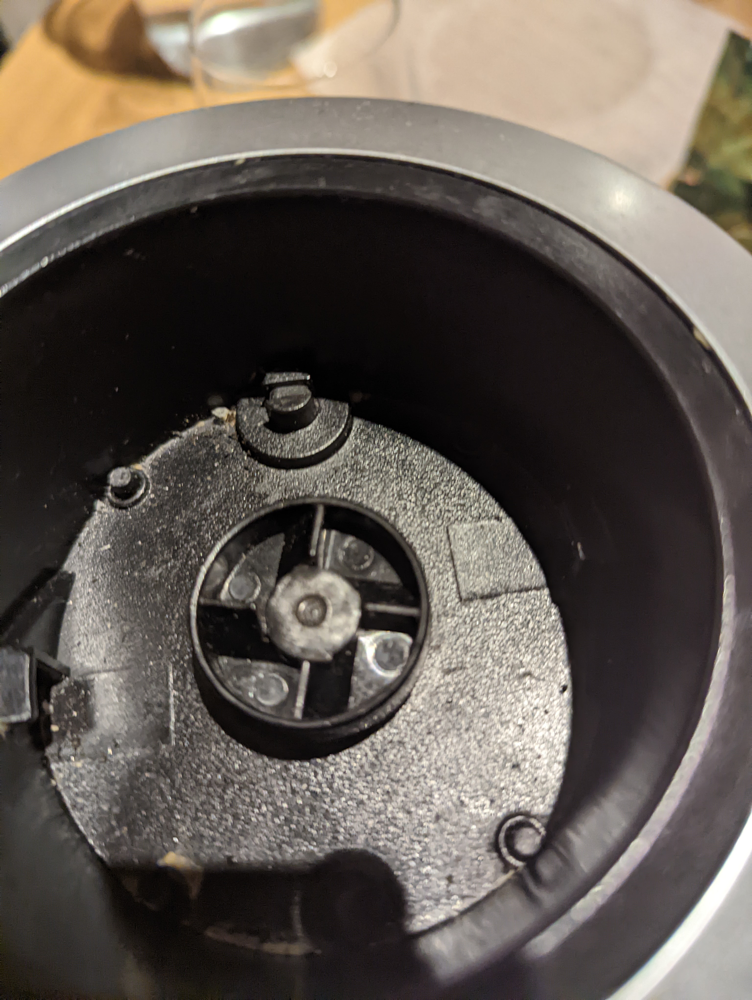
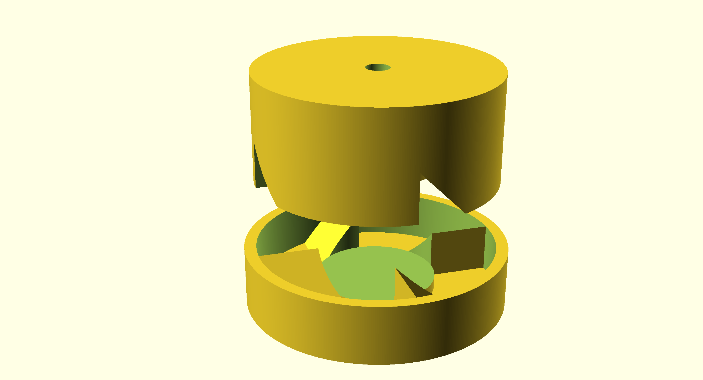

My friend had a broken coupler on his blender. So I designed a new one using
OpenSCAD. Its a form of Computer Aided Design (CAD) which which uses
scripting to add and subtract solids from each other. The whole project in in
[this repo.](https://github.com/cjmakes/blender_coupler/tree/main)

The part which broke is the bottom of the cup that engages with the teeth in
the base of the blender. Here is a picture of the base.



I modeling this base with teeth. Then subtracted it from a cylinder to get
the piece that I needed. Here is what I ended up with.



One cool thing I did with was using loops and functions to build and rotate
the teeth on the base.

```openscad
for (a=[0:90:360])
    rotate([0,0,a])
        tooth(R2,R1,HEIGHT); 

//...

module tooth(l,w,h){
    rotate([90,0,90])
        linear_extrude(l, false)
            polygon([[0,0],[w,0], [0,h]]);
}
```
